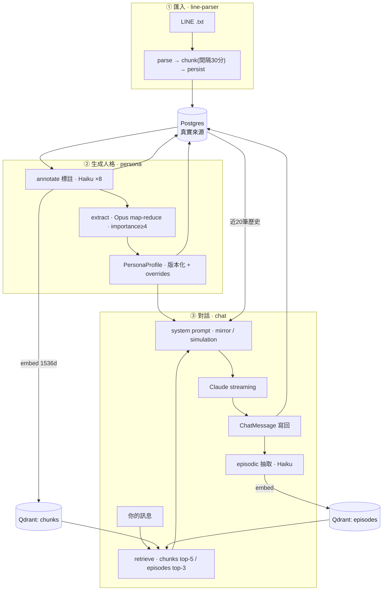

# Cookie

> 「我是誰？」— 任何一個剛醒來的 Cookie，第一句話

一個用你 LINE 對話訓練出來的個人化 AI 鏡子。它知道你說過的話，但它不是你。
詳見 [docs/00-project-philosophy.md](docs/00-project-philosophy.md)。

---

## 這是什麼

把你的 LINE 對話匯出檔（`.txt`）交給它，它會：

1. **解析、分群、標註**你的對話，歸納出一份結構化的人格畫像（Persona）。
2. 在**對話**時，依你當下的訊息檢索相關記憶、套上人格，扮演「另一個你」——預設是**鏡像模式**（反問你、把模式照回給你），也可切**模擬模式**（直接以你的口吻回答）。
3. 全程以一顆會呼吸、隨對話狀態反應的 **3D 玻璃蛋形**呈現；在 chat 場景可選擇開啟鏡頭，把「你」即時折射進它的形體。

原始檔案解析完即丟棄，只保留結構化訊息；資料留在你自己的部署裡。

---

## Quick start

```bash
# 1. 安裝依賴
pnpm install

# 2. 啟動本地 postgres / redis / qdrant
docker compose up -d

# 3. 環境變數
cp .env.example .env.local
# 編輯 .env.local 填入 ANTHROPIC_API_KEY / OPENAI_API_KEY

# 4. 推 schema + 初始化向量庫
pnpm db:push
pnpm qdrant:init

# 5. 啟動
pnpm dev
```

開啟 [http://localhost:3000](http://localhost:3000)。

> Postgres 在 host 上開 **5433** 埠（避免與 Homebrew/系統 postgres 衝突）。
> Qdrant 6333、Redis 6379。詳見 `docker-compose.yml`。

## 本地模擬模式（無需 DB / API 額度）

想在沒有真實資料、不呼叫 Claude/OpenAI 的情況下跑過整條流程，在 `.env.local` 設：

```bash
NEXT_PUBLIC_PERSONA_MOCK="1"   # 設定後需重啟 dev server
```

開啟後：

- **`/onboarding/process`**：「開始生成」走記憶體中的假進度（標註 → 抽取 → 完成 → 跳轉 `/chat`），並自動帶入假的匯入統計。
- **`/chat`**：問問題會由「另一個我」串流一段 mock 回覆（鏡像／模擬兩種口吻），對話存在記憶體、可重跑。不需要 active user 或 persona。

正式環境請維持 `0`（`.env.example` 預設即為 `0`）。

---

## 技術棧

| 類別 | 選用 | 角色 |
|------|------|------|
| 框架 | **Next.js 15**（App Router）+ React 19 + TypeScript | SSR、Route Handlers（API）、串流 |
| 樣式 | Tailwind CSS 4、shadcn/ui（Radix）、Framer Motion | 設計 token、元件、轉場動畫 |
| 3D | React Three Fiber 9 + drei 10 + postprocessing + Three.js | Cookie Shell 蛋形與粒子場 |
| 狀態 | Zustand（client） | Cookie 狀態機、webcam stream |
| 資料庫 | **Postgres**（Prisma 6） | 結構化真實來源（訊息、chunk、persona、對話） |
| 向量庫 | **Qdrant**（REST client） | 語意檢索（chunks / episodes，1536 維、cosine） |
| 快取 | Redis（ioredis） | session / 快取 |
| LLM | **Anthropic Claude**（SDK） | 標註、人格抽取、對話、情節抽取（三層模型） |
| Embedding | **OpenAI** `text-embedding-3-small`（1536 維） | 向量化 chunk / episode |
| 驗證 | Zod | API 輸入與型別推導 |

LLM 三層（`src/lib/anthropic.ts` 的 `MODELS`）：

- `primary` — `claude-sonnet-4-5`（可用 `ANTHROPIC_MODEL` 覆寫）→ **對話**
- `heavy` — `claude-opus-4-7` → **mini-persona / final persona 抽取**
- `light` — `claude-haiku-4-5` → **chunk 標註 / 情節抽取**（低成本批次）

所有 Claude 呼叫都帶 `metadata.user_id`（userId 的 sha256 截斷，不含 PII）。

---

## 系統架構

三條主要資料流：**匯入 → 生成人格 → 對話**。



帶標註的線性視圖：

```
LINE .txt
   │  parse（iOS/Android 格式）→ chunk（間隔 30 分鐘分群）→ persist
   ▼
Postgres： UploadedChat / LineMessage / ConversationChunk
   │  annotate（Haiku ×8 併發；摘要・語氣・你的立場・主題・importance 1–10）
   │  embed（OpenAI 1536d）→ Qdrant: chunks
   ▼
extract（Opus，map-reduce）：importance≥4 的 chunk
   │  → 依 chatType 分組做 mini-persona → 合併成 PersonaProfile（版本化、可疊 manualOverrides）
   ▼
對話：你的訊息
   │  retrieve（Qdrant：chunks top-5 + episodes top-3，importance≥4）
   │  + 啟用中的 persona + 近 20 筆歷史 → 組 system prompt（mirror / simulation）
   │  → Claude streaming → 寫回 ChatMessage（附 retrieved ids 供透明顯示）
   │  → 背景：情節抽取（Haiku）→ embed → Qdrant: episodes
   ▼
下一輪對話能「想起」先前的聊天
```

**Postgres 是真實來源，Qdrant 是檢索層。** 每個 chunk / episode 在 Postgres 有一筆紀錄、在 Qdrant 有一個對應的 `qdrantPointId`。

---

## 專案結構

```
src/
├── app/
│   ├── page.tsx                 首頁 hero（有 active persona 則導向 /persona）
│   ├── onboarding/              上傳 → 預覽 → process（生成）
│   ├── chat/                    對話鏡像場景
│   ├── persona/ memory/ audit/ settings/
│   └── api/
│       ├── ingest/[preview]     上傳解析 / 預覽
│       ├── persona/[generate|estimate|status|versions|activate|overrides|...]
│       ├── chat/[history|session]
│       ├── chats/ memory/ audit/ health/
├── components/
│   ├── cookie-shell/            R3F 蛋形：CookieShell / Scene / Egg / ParticleField / PostFX / shaders
│   ├── chat/                    ChatWindow / WebcamLayer / DreamBackground / MemoryWords / MessageBubble …
│   ├── onboarding/              FileDropzone / hospital-room（3D 病房）
│   ├── persona/ shared/ ui/     PageTransition、GlitchText、shadcn 元件 …
├── server/                      伺服端邏輯（見下）
│   ├── line-parser/  persona/  memory/  chat/  user.ts  audit.ts
├── lib/                         db / redis / qdrant / anthropic / embedding / utils
├── hooks/                       useChat / usePersona / useWebcam / useAsyncAction …
├── types/                       chat / persona / memory / line / ingest（含 Zod schema）
└── styles/                      tokens.css / glitch.css
prisma/schema.prisma             Postgres schema
scripts/                         init-qdrant / reset-vector-db / seed-test-data / test-parse
```

---

## 實作細節

### 匯入與 LINE 解析（`src/server/line-parser/`）

- **`parse.ts`**：把 LINE `.txt` 轉成 `LineMessage[]`。處理 iOS／Android 兩種匯出格式（日期分隔行切換日期、無時間戳的行併入前一則、`[貼圖]`/`[照片]`/`[語音訊息]`/URL/系統訊息分類）。
- **`metadata.ts`**：從首行推斷聊天室名稱與類型（一對一／群組）。
- **`chunk.ts`**：`chunkByTimeGap()` 依**時間間隔 30 分鐘**切段，並要求每段至少 4 則訊息、其中至少 1 則是你說的，才成為一個 `ConversationChunk`。
- **`persist.ts`**：寫入 `UploadedChat` → `LineMessage` → `ConversationChunk`，並把訊息掛回所屬 chunk。
- API：`POST /api/ingest`（寫入 DB）、`POST /api/ingest/preview`（只解析、不寫入）。

### Persona 生成 pipeline（`src/server/persona/`）

- **`generate.ts` `runPersonaPipeline()`**：總指揮——標註所有未標註 chunk → 取 importance≥4 → 抽取 → 寫入一個新的 `PersonaProfile` 版本 → 記 audit。可重跑，每次新增一個 version。
- **`annotate-batch.ts`**：以 `p-limit(8)` 併發呼叫 **Haiku**，為每個 chunk 標出摘要、語氣、你的立場、主題、importance（1–10）。
- **`extract.ts`**：map-reduce 抽取（**Opus**）。先依 `chatType` 分組產出 mini-persona，再合併成完整 `PersonaProfile`（核心認同、思考模式、溝通風格、知識領域、情緒輪廓、關係、自我覺察、紅線等切面）。
- **`update.ts` / `overrides.ts`**：讀取啟用中的 persona、版本切換、把使用者的 `manualOverrides` 疊加在原始 persona 之上。
- **`status.ts`**：記憶體中的進度（`annotating → extracting → done | error`），供 `/api/persona/status` 輪詢。
- 標註後由 `memory/embed-chunks.ts` 把 chunk 向量化寫進 Qdrant `chunks`。

### 對話 pipeline（`src/server/chat/`）

- **`pipeline.ts` `prepareChatTurn()`**：載入啟用 persona → `retrieveMemories()` 檢索記憶 → `buildSystemPrompt()` 組 prompt → 回傳給 `anthropic.messages.stream()` 的請求。
- **`system-prompt.ts`**：組裝 system prompt，內含「你不是本人、是模仿物」的聲明、persona 各切面、以及模式區塊：
  - **mirror（預設）**：當一面鏡子，把模式照回、反問，不給建議。
  - **simulation**：依模式直接以你的口吻作答。
- **`session.ts`**：`getOrCreateActiveSession()` 管理對話 session。
- **`POST /api/chat`**：寫入 user 訊息 → 串流 Claude → 串流結束後在背景寫入 assistant 訊息、記 audit、抽取情節記憶。回應為 `text/plain` 串流（`X-Accel-Buffering: no`）。

### 記憶層（`src/server/memory/`）

- **語意記憶（chunks）**：你過去的對話段落。`retrieve.ts` 對 query embedding 在 Qdrant `chunks` 搜尋，`importance≥4`、取 **top-5**。
- **情節記憶（episodes）**：和 Cookie 聊天時產生的長期記憶。`episodic.ts` 在每輪對話後用 **Haiku** 從最近幾則抽出值得記住的片段（importance≥4 才寫入），embed 後存進 Qdrant `episodes`；檢索取 **top-3**。
- 對話訊息會記錄 `retrievedChunkIds` / `retrievedEpisodeIds`，UI 透明顯示「想起 N 段對話」。

### Cookie Shell 3D 與 chat 鏡像場景

- **`cookie-shell/`**：R3F 畫布，`Egg` 用 drei `MeshTransmissionMaterial`（玻璃折射）+ 自訂 shader 做呼吸與 fresnel；`ParticleField` 是內部粒子；`PostFX` 加 bloom／色差／glitch。
- **狀態機 `useCookieState`**（Zustand）：`idle / listening / thinking / speaking / awakening / glitch`，由打字、串流等事件驅動蛋形的自轉速度、脈動與粒子行為。
- **Chat 三層構圖**（受 Black Mirror「cookie」啟發）：
  - 背景 = `DreamBackground`：光之虛空（體積光束、被打亮的塵粒、地平線景深、電影感暗角），光束強度隨對話狀態呼吸；`MemoryWords` 在遠處飄動「你說過的話」碎片（佔位字串，預留 `fragments` prop 接真實 retrieval）。
  - 左側 = 玻璃蛋形「另一個我」，啟用鏡頭後（`WebcamLayer` + `useWebcam`）把鏡頭做成 `VideoTexture` 餵給蛋的 `buffer`，**把你即時折射進它的形體**。鏡頭畫面只留在本分頁、不上傳。
  - 蛋形隨對話狀態反應；中央不再有控制台。
- 路由切換為「淡出 → 淡入」的溶解轉場（`shared/PageTransition.tsx`）。

### Mock 模式（`NEXT_PUBLIC_PERSONA_MOCK`）

`server/persona/mock.ts` 與 `server/chat/mock.ts` 提供記憶體假資料。以下路由在開啟時短路、跳過 user／DB／Claude：`/api/persona/{estimate,status,generate}`、`/api/chat`、`/api/chat/history`、`/api/chat/session`。對話狀態掛在 `globalThis`（Next dev 會把模組依 route 各自打包，需此才能跨 route 共享）。

---

## 資料層

### Postgres（`prisma/schema.prisma`）

| Model | 用途 |
|-------|------|
| `User` | 單人 app 的使用者（cookie 對應） |
| `UploadedChat` | 一次匯入的聊天檔（聊天室、類型、統計） |
| `LineMessage` | 單則訊息（時間、說話者、isYou、類型、內容、所屬 chunk） |
| `ConversationChunk` | 對話段落（時間範圍、參與者、標註欄位、importance、`qdrantPointId`） |
| `PersonaProfile` | 版本化人格（`profile` JSON、`manualOverrides`、`isActive`、`parentVersionId`） |
| `ChatSession` / `ChatMessage` | 對話 session 與訊息（含 `retrieved*Ids`、`tokensUsed`、`modelUsed`） |
| `Episode` | 情節記憶（摘要、importance、情緒值、`qdrantPointId`、soft delete） |
| `AuditLog` | 使用者行為稽核（上傳、生成、編輯、對話、匯出、清除） |

enum：`ChatType` / `MessageType` / `ChatRole` / `AuditAction`。

### Qdrant（`scripts/init-qdrant.ts`）

- **`chunks`**：1536 維、cosine。payload 含 `userId / uploadedChatId / summary / yourPosition / topics / importance / chatType / startTime`。
- **`episodes`**：1536 維、cosine。payload 含 `userId / sessionId / summary / importance / createdAt`。

---

## 路由與 API

**頁面**：`/`（hero）、`/onboarding`（上傳→預覽→process）、`/chat`、`/persona`、`/memory`、`/audit`、`/settings`。

**API（`src/app/api/`）**

| 路由 | 方法 | 說明 |
|------|------|------|
| `/api/ingest` · `/api/ingest/preview` | POST | 上傳解析並寫入 DB / 只預覽不寫入 |
| `/api/persona` | GET | 取啟用 persona（已疊 overrides） |
| `/api/persona/generate` | POST | 觸發生成 pipeline（fire-and-forget，202） |
| `/api/persona/estimate` · `/status` | GET | 成本/時間預估 · 進度輪詢 |
| `/api/persona/versions` · `/activate` · `/overrides` | GET/POST/PUT | 版本列表 · 切換啟用版本 · 寫入手動覆寫 |
| `/api/persona/{slice,footprint,avoidance,evidence}` | — | 切片、版本譜系、避談過濾、證據 |
| `/api/chat` | POST | 串流對話（mirror / simulation） |
| `/api/chat/history` · `/session` | GET/POST | 對話歷史 · session 管理 |
| `/api/chats` · `/api/memory` · `/api/audit` | GET(/DELETE) | session 列表 · 記憶檢視/刪除 · 稽核 |
| `/api/health` | GET | 健康檢查（Railway） |

---

## 指令

| 指令 | 用途 |
|------|------|
| `pnpm dev` | 啟動 dev server（Turbopack） |
| `pnpm build` / `start` | `prisma generate` + build / 啟動 production |
| `pnpm type-check` / `lint` / `format` | 型別檢查 / ESLint / Prettier |
| `pnpm db:push` / `db:migrate` / `db:studio` / `db:seed` | 推 schema / 遷移 / Prisma Studio / 種子資料 |
| `pnpm qdrant:init` / `qdrant:reset` | 初始化 / 重置 Qdrant collections |
| `pnpm test:parse [檔案]` | 測試 LINE 解析（內建 fixtures 或指定檔案，不寫 DB） |

---

## 文件

- [專案理念](docs/00-project-philosophy.md)
- [Next.js 結構](docs/01-nextjs-project-structure.md)
- [Cookie Shell 視覺實作](docs/02-cookie-shell-webgl.md)
- [LINE Parser + Persona](docs/03-line-parser-persona-prompts.md)
- [Postgres + Qdrant Schema](docs/04-postgres-qdrant-schema.md)
- [差異化・鏡子論](docs/05-differentiation-mirror-thesis.md)
